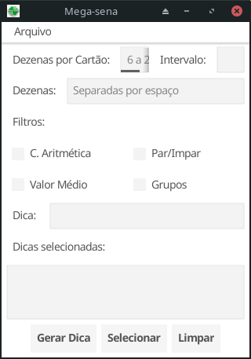
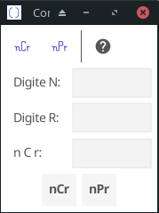

# go-fyne-intro
> Aprendizado de linguagem Go e Fyne GUI toolkit.

## Conteúdo
* [Projeto Mega Sena](#projeto-mega-sena)
* [Projeto Calcomb](#projeto-calcomb)
* [Agradecimentos](#agradecimentos)
<!-- * [License](#license) -->

## Projeto Mega Sena
- Um aplicativo para criar dicas de apostas na Mega-sena, uma loteria operada pela CEF/Brasil.
### Executar o aplicativo
`> go run megasena.go data.go`
### Facilidades oferecidas
> 1: Gerar dicas de apostas para a Mega-sena
> 2: Aplicar filtros na geração das dicas
> 3: Selecionar dicas para as apostas
> 4: Arquivar as dicas selecionadas
> 5: Recuperar as dicas arquivadas
> 6: Conferir os acertos das apostas (dicas selecionadas)
> OBS: nenhuma verificação de erro é feita
### Captura de tela

### Modo de usar
#### Campos
- *Dezenas por Cartão*: digitar o número de dezenas por cartão (um valor entre 6 e 20).
- *Intervalo*: digitar o intervalo para sorteio das dezenas, separado por espaço. Por exemplo, se for digitado _10 20_ as dezenas das dicas serão escolhidas neste intervalo. Se nada for digitado, adota-se o intervalo de _01 a 60_.
- *Dezenas*: digitar as dezenas separadas por espaço em branco. Aqui, três situações podem ocorrer: 
1) se for digitado um número de dezenas menor do que o número de Dezenas por Cartão, a dica incluirá estas dezenas e as restantes serão sorteadas dentro do Intervalo informado;
2) se for digitado um número de dezenas igual ao número de Dezenas por Cartão, a dica será formada por estas dezenas;
3) se for digitado um número de dezenas maior do que o número de Dezenas por Cartão, a dica será formada por dezenas sorteadas desta lista;
- *Filtros*:
1) *Complexidade Aritmética* - para evitar dicas em progressão aritmética;
2) *Par/Impar* - filtra dicas com mais de 5 dezenas pares ou ímpares;
3) *Valor Médio* - filtra dicas com mais de 5 dezenas acima ou abaixo do valor médio (30);
4) *Grupos* - filtra dicas com 4 ou mais dezenas num mesmo grupo (01-09, ..., 50-59);
- *Dica*: apresenta a dica gerada.
- *Dicas selecionadas*: lista as dicas escolhidas para a aposta.
#### Botões de comando
1) *Gerar Dica* - gera uma dica de acordo com as especificações.
2) *Selecionar* - acrescenta a dica na lista de dicas selecionadas.
3) *Limpar* - limpa os campos, exceto o _Dicas selecionadas_.
#### Menu Arquivo
1) *Abrir* - abre um arquivo com dicas selecionadas;
2) *Salvar* - grava as dicas selecionadas em arquivo, para conferência posterior;
3) *Conferir* - abre uma janela para conferir as dicas selecionadas com o resultado do sorteio;
4) *Quit* - sair do programa.
#### Melhorias futuras
- Versão para Android
- Aba para gerar os cartões, garantindo um acerto na Quadra ou na Quina.
### Tabela de Prêmios da Megasena
> Para gerar a tabela de prêmios pagos pela Mega-sena:
`> go run tab-cef.go`

## Projeto Calcomb
- Aprendizado básico de Golang e Fyne.
- Apresenta uma simples IU para calcular nCr e nPr.

## Agradecimentos
- Aos desenvolvedores da linguagem Go
- Aos desenvolvedores do projeto Fyne

<!-- Optional -->
<!-- ## License -->
<!-- This project is open source and available under the [... License](). -->

<!-- You don't have to include all sections - just the one's relevant to your project -->
